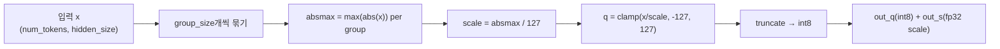
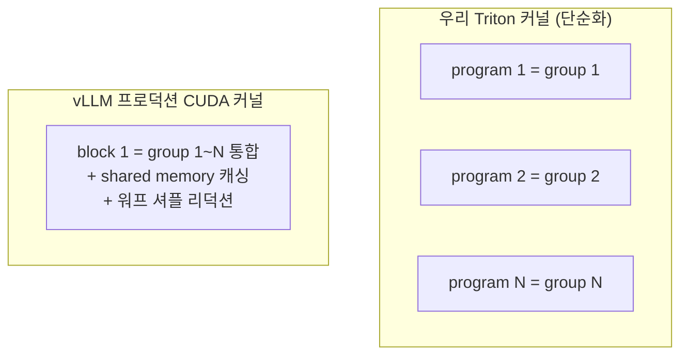
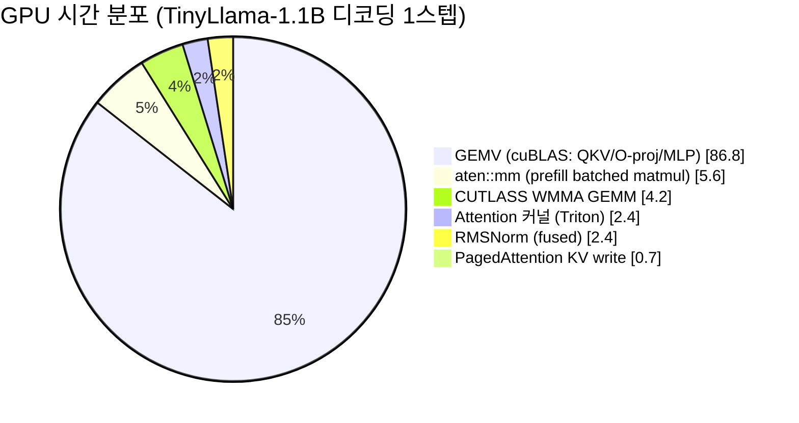

# vLLM 커널 실습 — group quantization

vLLM의 `csrc/libtorch_stable/quantization/w8a8/fp8/per_token_group_quant.cu`
(`per_token_group_quant_8bit_kernel`)을 단순화해서 Triton으로 다시 구현하고,
`torch.ops.*`로 등록해본 연습 프로젝트입니다.

## 커널이 하는 일



## 파일
- `group_quant_triton.py` — 실제 Triton 커널 (`@triton.jit`)
- `group_quant_op.py` — 위 커널을 `torch.ops.practice.group_quant_int8`로 등록
  (vLLM의 `STABLE_TORCH_LIBRARY` + `STABLE_TORCH_LIBRARY_IMPL` 패턴의 Python판)
- `test_group_quant.py` — PyTorch 순정 구현과 정확도 비교 + 벤치마크

## Colab에서 돌리기
1. 새 노트북 만들고 이 폴더의 3개 `.py` 파일을 업로드 (또는 같은 내용을 셀에 붙여넣기)
2. **런타임 > 런타임 유형 변경 > GPU** 선택
3. 셀에서:
   ```python
   !python test_group_quant.py
   ```
4. `group_quant_op.py`를 직접 실행해서 등록된 op 확인:
   ```python
   !python group_quant_op.py
   ```

## 원본 CUDA 커널과 다른/단순화한 부분
- 원본은 블록 하나가 여러 그룹(`groups_per_block`)을 처리하고 그룹 하나를
  16개 스레드가 나눠 처리하지만, 여기서는 **Triton 프로그램 하나 = 그룹 하나**로
  단순화했습니다 (`grid = num_tokens * num_groups`).
- 원본은 워프 셔플로 리덕션하고 shared memory에 값을 캐싱해 DRAM을 한 번만
  읽지만, 여기서는 `tl.max`로 리덕션을 Triton이 알아서 처리하게 맡겼습니다.
- scale 계산 후 clamp가 `[-127, 127]`인 것까지는 원본과 동일한 알고리즘입니다.
- 원본은 반올림 없이 truncate(`DST_DTYPE(q)` 캐스트)만 하는데, 이 실습에서도
  그대로 truncate로 맞췄습니다. (처음엔 reference를 `round()`로 짰다가, 원본과
  다른 반올림 방식이라 tie 경계에서 결과가 갈리는 걸 직접 겪고 고쳤습니다.)

## 디버깅 중 발견한 것: fp32 나눗셈 정밀도 차이
Triton 커널과 PyTorch reference를 완전히 같은 수식으로 짜도, 결과 int8 값이
0.2% 정도(9472개 중 20개) 다르게 나온 적이 있습니다. 원인은 `x / scale` 나눗셈
자체가 Triton과 PyTorch에서 **bit-identical하지 않다는 것** — GPU는 성능을 위해
나눗셈을 근사 역수(fast reciprocal approximation)로 계산하는 경우가 많아서, 참값이
`127.0`처럼 정수 경계에 아주 가까우면(`126.999996` vs `127.000001`) truncate 결과가
이웃한 정수로 갈릴 수 있습니다. 로직 버그가 아니라 fast-math 트레이드오프의 흔적이라,
`test_group_quant.py`는 "완전 일치"가 아니라 "경계 근처에서만, 드물게, 최대 1 차이까지"
허용하도록 짜여 있습니다. Edge 디바이스에서 정밀도-속도 트레이드오프를 다룰 때 실제로
부딪히는 종류의 문제라 그대로 남겨뒀습니다.

## 실제 vLLM 프로덕션 커널과 비교 (`group_quant_walkthrough.ipynb`)

우리 Triton 커널(program 1개 = group 1개, 단순화)과 vLLM 프로덕션 CUDA 커널
(`per_token_group_quant_int8` — block 1개가 여러 group을 shared memory 캐싱 +
워프 셔플 리덕션으로 처리)을 `torch.ops.*`로 직접 호출해 3-way 벤치마크했습니다.



`group_size`를 32~4096까지 스윕해서 속도·양자화 오차·scale 메모리 오버헤드를
같이 재봤습니다 — 그룹이 작을수록 오차는 줄지만 scale 저장 비용이 늘어나는
전형적인 edge-device 트레이드오프입니다.

## `run_vllm_on_colab.ipynb` — vLLM을 실제로 돌려서 병목 확인

커널 하나만 보는 대신, vLLM 자체를 Colab GPU에서 띄워 TinyLlama-1.1B로 실제
추론을 돌리고 `torch.profiler`로 GPU 시간을 프로파일링했습니다.



**핵심 발견**: attention 커널은 GPU 시간의 2.4%뿐이고, 압도적 1위는 GEMV(86.8%)
입니다. 디코딩은 배치=1이라 가중치 원소 하나당 곱셈을 한 번만 해서
memory-bandwidth-bound가 되기 때문입니다 — 이게 바로 이 저장소의 group
quantization 커널이 실제로 푸는 문제입니다 (가중치를 int8로 줄여 HBM에서
읽어야 할 바이트 수 자체를 줄임). Colab/Jupyter 환경에서 vLLM을 직접 띄우며
겪은 `libcudart.so` 경로, fork+CUDA 크래시, `pynvml` 초기화 실패 같은 실전
이슈들도 커밋 로그에 그대로 남아있습니다.

## 다음 실습 아이디어 (edge 제약 관점)
- `group_size`를 32/64/128/256으로 바꿔가며 벤치마크 → 그룹이 작을수록
  스케일 정밀도는 좋아지지만 오버헤드(스케일 개수)가 늘어나는 트레이드오프를
  직접 수치로 확인
- `_group_quant_int8_kernel`을 원본처럼 "프로그램 하나가 여러 그룹을 처리"하도록
  바꿔보고 성능이 어떻게 달라지는지 비교 (이게 원본의 `groups_per_block` 최적화)
- INT8 대신 INT4로 바꿔서 압축률/정확도 트레이드오프 실험 (edge 메모리 제약
  시나리오에 더 가까움)
